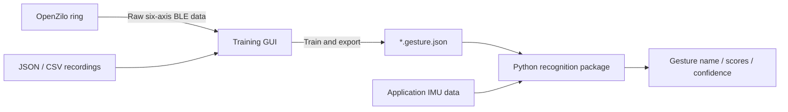

<p align="center">
  <a href="https://openzilo.com"></a>
</p>

<h1 align="center">OpenZilo Gesture Studio & Python Recognition</h1>

<p align="center">Connect a ring, record and train gestures in a desktop GUI, then export them to your Python application.</p>

<p align="center">
  <a href="README.zh-CN.md">中文</a> · <a href="studio/README.md">Studio guide</a> ·
  <a href="docs/architecture.md">Architecture & export format</a> · <a href="docs/sdk.md">SDK integration</a> ·
  <a href="LICENSE">MPL-2.0</a>
</p>

An official OpenZilo reference project for custom ring gestures using left-to-right Gaussian HMMs. There are two **separately installable distributions**:

| Component | Location / import | Responsibility |
| --- | --- | --- |
| `hmm-gesture-studio` | `studio/` / `hmm_gesture_studio` | Tkinter GUI for live six-axis charts, gesture recording/training/export, live testing, and receiving/downloading ring recordings. Depends on the runtime and official OpenZilo SDK. |
| `hmm-gesture` | `src/hmm_gesture/` / `hmm_gesture` | Load exported gestures and classify complete segments or continuous batches. Depends only on NumPy, SciPy and hmmlearn; **no GUI, Bluetooth SDK or Studio dependency**. |



> Training and recognition run on the **host computer**. This project does not flash firmware, upload models to the ring, or replace device-side `0x0702` recognition. It consumes raw `0x0605` IMU reports.

## Install and launch Studio

Requires [uv](https://docs.astral.sh/uv/getting-started/installation/), Git and a Python installation with Tkinter. `.python-version` selects Python **3.12** for development; both packages still support Python 3.10+.

```bash
git clone https://github.com/ziloai/OpenZilo-HMM.git
cd OpenZilo-HMM
uv sync --locked --all-packages
uv run --locked --all-packages hmm-gesture-studio
# Alternative: uv run --locked --package hmm-gesture-studio python -m hmm_gesture_studio
```

The two packages form one uv workspace, sharing `.venv/` and the checked-in `uv.lock`. `--all-packages` installs both; no manual environment activation is needed. `--locked` verifies that dependency declarations match the lockfile. Dependencies are maintained in `pyproject.toml`, not a separate requirements file.

Tkinter comes from your Python/OS installation, not a Python package dependency. On Debian/Ubuntu install `python3-tk`; Homebrew Python requires the matching `python-tk` version. If necessary, select a Tk-enabled interpreter with `uv sync --locked --all-packages --python /path/to/python3.12`. Run the GUI in a graphical desktop session. The interface currently uses Chinese labels.

### Recording, training and export

1. Scan/select the ring or enter its address, then connect. macOS typically uses a UUID. BLE connection and IMU readiness are separate: connecting in recording mode is supported, and values resume once gesture mode starts reporting.
2. Enter a gesture name. Start a take, perform one gesture, then stop. Record at least two repetitions (five or more recommended), then save. Takes shorter than 12 samples are rejected. Saving an existing name asks to append, requiring the same rate and preserving prior takes.
3. Select a data directory (default `gestures/`), inspect recording counts/lengths, or import JSON and headerless CSV files. Each CSV is one repetition with six integer columns. Unsaved takes can be undone or cleared; the name is locked while they exist to avoid mixing labels.
4. Set the sample rate to match the data, then train all datasets. Training runs in the background. Mixed rates are rejected; cutoff frequency must be below half the sample rate. Changing data/settings invalidates the previous training result.
5. Export a **`*.gesture.json`** file containing labels, HMM parameters, preprocessing and segmentation settings. Consumers do not need to reconstruct training settings.
6. Load an export or use the current model for live testing with a matching-rate ring. Begin at rest to establish a baseline and return to rest between gestures.

The live chart tab shows acceleration and gyroscope traces with freeze/clear controls; freezing the display does not pause capture. There is one IMU consumer, with idle batches discarded between takes. Mode-related pauses retain BLE and retry IMU reporting when gesture mode returns; real link loss triggers reconnect with backoff. Gaps cancel unfinished takes but preserve completed ones. Manual disconnect stops retries, and shutdown cleans up reports and the link. Studio does not change device modes or hardware sample rates.

BLE requires an adapter and permissions (BlueZ on Linux, terminal/IDE Bluetooth permission on macOS). Gesture features do not need `ffmpeg`; decoding ring recordings into WAV requires a system `ffmpeg` installation, with raw `.bin` preserved if decoding is unavailable. Integration targets SDK **0.5.0**, protocol **v4**, and upstream firmware documentation baseline **`V2.000.0001.0015`**; verify your hardware/firmware. The exact SDK commit is pinned in [`studio/pyproject.toml`](studio/pyproject.toml).

## Ring recordings

In the recording tab, select an output directory and enable automatic reception. Put the ring in recording mode, **hold its physical button to record, then release to push the file**. Studio saves the raw `.bin` and, when ffmpeg is installed, a playable WAV. Missed recordings can be listed and downloaded by index; device files are never automatically deleted.

The SDK has **no host-side start/stop recording command**. GUI controls only arm/stop reception or downloading, not the ring microphone. Audio operations pause IMU requests; stop reception before returning to gesture testing. Interrupted transfers require a fresh download, and transfer progress is not a live recording timer. See the [Studio guide](studio/README.md).

## Try without hardware

Choose `sample_data/` in the GUI and train, or use the new export CLI:

```bash
uv run --locked --package hmm-gesture-studio hmm-gesture-train --data sample_data --output exports/demo.gesture.json
uv run --locked python examples/recognize_export.py --bundle exports/demo.gesture.json --input "sample_data/向上.json"
```

Six example gestures are supplied: snap, flick, up, down, left and right, with five repetitions each at 25 Hz. Names remain Chinese. Legacy JSON without a rate is interpreted as 25 Hz. Classifying the same recordings used for training verifies the pipeline, **not independent accuracy**.

## Use only the Python recognition package

From the repository root, `uv sync --locked` installs only the runtime and its dependencies (and removes Studio/BLE packages from the shared environment). To add the runtime to a different uv application, run there:

```bash
uv add /path/to/OpenZilo-HMM
```

Or build a standalone wheel from this repository, then add that wheel in the consumer project:

```bash
uv build --package hmm-gesture --wheel
# In the consumer project:
uv add /path/to/OpenZilo-HMM/dist/hmm_gesture-0.2.0-py3-none-any.whl
```

Given `samples`, an `(N, 6)` array/list containing one complete gesture:

```python
from hmm_gesture import GestureRecognizer

recognizer = GestureRecognizer.load("demo.gesture.json", min_confidence=0.0)
print(recognizer.gesture_names, recognizer.sample_rate_hz)

result = recognizer.predict(samples, sample_rate_hz=25)
if result is not None:
    print(result.name, result.confidence, result.score)
```

For continuous data, the application owns acquisition (SDK, serial, network or files):

```python
# Each batch contains rows [ax, ay, az, gx, gy, gz].
for result in recognizer.feed(batch, sample_rate_hz=25):
    print(result.name, result.confidence)

recognizer.reset()  # Reset stream state and baseline on reconnect/repositioning.
```

`feed()` returns **all** completed predictions in a batch, not just the last. `predict()` does not segment and returns `None` for fewer than two feature windows. Exports use versioned JSON numeric parameters, never pickle deserialization. See [architecture and format](docs/architecture.md).

### Data and recognition limits

- Axis order is **`ax, ay, az, gx, gy, gz`**, in raw signed int16 units, not g or degrees/second. Shape, finiteness and range are checked.
- Passing `sample_rate_hz` checks consistency; it does not configure hardware or resample. Keep orientation, units and sensor ranges consistent with training.
- Segmentation uses motion relative to an idle baseline: default threshold 1500, minimum 12 samples, maximum 125. Overlong movements are discarded; incomplete gestures are not flushed at end of input.
- Confidence is a relative likelihood-gap heuristic, **not a calibrated probability or reliable unknown-gesture detector**. A single model has fixed confidence 0.8.
- Recognizers maintain one stream's state and are not intended to be shared between threads/devices. Evaluate with independent recordings.

## Existing command-line compatibility

After installing both components, the original scripts still work:

```bash
uv run --locked --all-packages python record_gesture.py --name snap --ring --address "DEVICE-ADDRESS" --reps 5
uv run --locked --all-packages python train_hmm.py --data sample_data --output models
uv run --locked --all-packages python recognize.py --models models --input "sample_data/向左.json"
```

The legacy trainer still emits `.pkl`, and the legacy recognizer can read it. **Only load trusted pickle files**: deserialization may execute code. They do not store preprocessing settings, so the new package/GUI deliberately does not import them. Retrain from recording JSON to produce a portable export. Legacy recording overwrites matching filenames; GUI saves use an append confirmation instead.

## Layout and development

```text
pyproject.toml                Runtime distribution and uv workspace
uv.lock                       Shared, version-controlled dependency lockfile
.python-version               Development Python version (3.12)
src/hmm_gesture/               Config, preprocessing, bundle, segmentation, inference
studio/pyproject.toml          Separate training platform and pinned SDK dependency
studio/src/hmm_gesture_studio/ GUI, datasets, training, background BLE service
examples/recognize_export.py   SDK/GUI-free consumer example
sample_data/                  Example recordings
pretrained_models/            Preserved legacy pickle examples
record_gesture.py, etc.       Compatibility CLI entry points
tests/                        Runtime/export, GUI controller and mocked SDK tests
```

```bash
uv run --locked --all-packages python -m unittest discover -s tests -v
uv build --all-packages --wheel
```

Add runtime dependencies with `uv add PACKAGE`, or Studio-only dependencies with `uv add --package hmm-gesture-studio PACKAGE`. These commands update the appropriate manifest and `uv.lock`; commit both. After manual manifest edits, run `uv lock` followed by `uv sync --locked --all-packages`. Upgrade a dependency deliberately with `uv lock --upgrade-package PACKAGE`, then sync and test.

Tests do not access real BLE hardware. Validate GUI and device behavior on target systems. See [SDK integration](docs/sdk.md) before changing the pinned SDK. Report issues at [GitHub Issues](https://github.com/ziloai/OpenZilo-HMM/issues).

## License

Software, documentation, example data, pretrained models and bundled assets are provided under [MPL-2.0](LICENSE), matching OpenZilo's software license. The supplied data, models and images are authorized for redistribution. Dependencies retain their own licenses; brands and trademarks belong to their owners. See [NOTICE.md](NOTICE.md).
