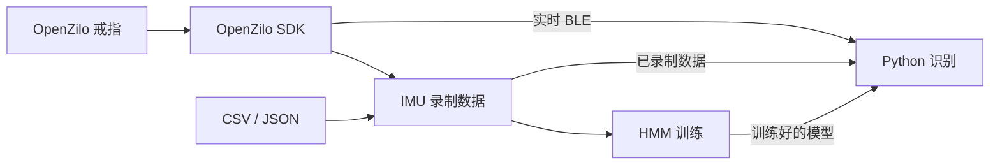

<p align="center">
  <a href="https://openzilo.com"></a>
</p>

<h1 align="center">OpenZilo HMM 手势识别</h1>

<p align="center">采集戒指手势，训练自定义模型，用 Python 实时识别。</p>

<p align="center">
  
  <a href="https://github.com/ziloai/OpenZilo"></a>
  <a href="LICENSE"></a>
</p>

<p align="center">
  <a href="https://openzilo.com">官网</a> ·
  <a href="https://openzilo.com/buy">获取开发套件</a> ·
  <a href="https://github.com/ziloai/OpenZilo">Python SDK</a> ·
  <a href="https://github.com/ziloai/OpenZilo-HMM/issues">问题反馈</a> ·
  <a href="#快速开始">快速开始</a> ·
  <a href="README.md">English</a>
</p>

这是 OpenZilo 官方的自定义戒指手势训练参考项目，使用隐马尔可夫模型（HMM）进行识别。通过 [OpenZilo Python SDK](https://github.com/ziloai/OpenZilo) 从戒指采集低功耗蓝牙（BLE）六轴 IMU 数据，在电脑上完成模型训练和推理。

OpenZilo 是面向可穿戴交互与 **ComBodied AI** 的开放开发平台。本项目可作为手势触发 AI Agent、桌面快捷操作、机器人控制和实验性交互的起点。

> 训练和识别都在**电脑端**运行。本项目不刷写固件、不向戒指上传模型，也不替换戒指内置的 `0x0702` 手势识别；它使用的是 `0x0605` 原始 IMU 批量数据。

## 项目包含什么？

- BLE 实时录制、CSV 导入和终端数据输入。
- 每种手势独立训练一个左到右 Gaussian HMM。
- 离线分类，以及带自动动作分段的 BLE 实时识别。
- 六种手势的示例数据和预训练模型：打响指、甩手、向上、向下、向左、向右。
- 不依赖硬件的 SDK 接入与离线流程测试。



## 开发套件与兼容性

**OpenZilo Q**（语音 + 手势）和 **OpenZilo X**（语音 + 手势 + 生理感知）均配有 IMU。本项目只使用加速度计和陀螺仪，不使用麦克风或 PPG。

当前接入基于 SDK **0.5.0**、协议 **v4**，以及上游文档的固件基线 **`V2.000.0001.0015`**。请确认手中套件与固件支持 IMU 上报；这不代表所有硬件版本都已通过测试。

## 快速开始

### 1. 安装环境

需要 **Python 3.10+**（推荐 3.11 或 3.12）和 Git。克隆仓库并安装依赖：

```bash
git clone https://github.com/ziloai/OpenZilo-HMM.git
cd OpenZilo-HMM
python -m venv .venv
source .venv/bin/activate
# Windows PowerShell：.venv\Scripts\Activate.ps1
python -m pip install --upgrade pip
python -m pip install -r requirements.txt
```

依赖包含 NumPy、SciPy、hmmlearn 和官方 OpenZilo SDK；SDK 会安装 Bleak。为便于复现，SDK 固定到上游提交 [`e9a861d`](https://github.com/ziloai/OpenZilo/commit/e9a861dd5c82a154fba0f1bafb628cd04fbd9555)，不跟随分支自动更新。无需复制 SDK 文件或修改 `sys.path`。

实时功能还需要 BLE 适配器和蓝牙权限。Linux 需要 BlueZ；macOS 需要允许终端或 IDE 使用蓝牙。离线训练和识别不需要戒指、蓝牙连接或 `ffmpeg`。

### 2. 不连接硬件先试一下

```bash
# 使用随仓库提供的模型，识别五次已录制的手势。
python recognize.py --models pretrained_models --input "sample_data/向上.json"

# 用六种示例数据重新训练模型。
python train_hmm.py --data sample_data --output models
python recognize.py --models models --input "sample_data/向左.json"
```

示例文件和识别标签保留中文命名，见下表。用这些示例数据训练后再识别同一批数据，只能验证流程，**不能作为独立的准确率评测**。

> 模型采用 Python pickle 格式。只加载可信来源的文件，反序列化可能执行代码。如果依赖升级导致模型不兼容，请用 JSON 数据重新训练。

### 3. 查找戒指

```bash
python -m openzilo scan --timeout 10
python -m openzilo info --address "AA:BB:CC:DD:EE:FF"
```

后续命令中的示例地址均需替换为 `scan` 返回的标识。macOS 通常返回 UUID，而不是 MAC 地址。扫描可能列出其他 BLE 设备，请选择自己的戒指，并断开其他正在占用它的应用。

### 4. 采集手势

文档所对应的固件启动后默认处于录音模式。**运行实时命令之前**，如有需要，单击戒指按键切换到手势模式，并等待切换完成。单击事件本身不能证明模式切换成功。SDK 没有查询或设置模式的接口，必须以 `start_sensor_report()` 成功返回为开始接收 IMU 的前提。

```bash
python record_gesture.py --name snap --ring --address "AA:BB:CC:DD:EE:FF" --reps 5
```

1. 在**电脑终端按回车**开始一次录制。
2. 完成一次手势，再按回车结束。
3. 重复直到取得五次有效录制。少于 12 帧的录制会重试，不占用次数。
4. 数据保存到 `gestures/snap.json`，采样率采用设备返回的实际值。

等待下一次录制期间，接收器会持续消费并丢弃空闲数据。电脑端采集和识别不需要长按戒指按键；录制过程中不要切换设备模式。

每种手势至少需要两次有效重复，建议从五次以上开始。采集多个手势类别，保持佩戴位置和方向一致，避免录入过长的静止时间。再次使用相同名称和输出目录会**覆盖**原 JSON 文件；中途取消不会保存未完成的会话。

也可以导入已有数据，每个**无表头 CSV** 文件对应一次重复：

```bash
python record_gesture.py --name snap --from-csv snap1.csv snap2.csv --sample-rate 25
python record_gesture.py --name snap --interactive --reps 5 --sample-rate 25
```

### 5. 训练并实时识别

```bash
python train_hmm.py --data gestures --output models
python recognize.py --models models --ring --address "AA:BB:CC:DD:EE:FF"
```

两次手势之间恢复静止，便于动作分段器判断边界。按 `Ctrl+C` 退出，程序会在断开连接前尝试停止 IMU 上报；停止上报不会把戒指切回录音模式。

## 示例数据与模型

| 手势 | `sample_data/` 中的数据 | `pretrained_models/` 中的模型 |
| --- | --- | --- |
| 打响指 | `打响指-hmm.json` | `打响指-hmm.pkl` |
| 甩手 | `甩-hmm.json` | `甩-hmm.pkl` |
| 向上 | `向上.json` | `向上.pkl` |
| 向下 | `向下.json` | `向下.pkl` |
| 向左 | `向左.json` | `向左.pkl` |
| 向右 | `向右.json` | `向右.pkl` |

每个数据文件包含五次重复，采样率为 **25 Hz**。这些文件用于开发演示，不是通用手势数据集。使用者、佩戴方向、IMU 量程、采样率和动作速度都会影响结果。面向实际用户时，应重新采集训练，并用独立录制的数据评测。

## 工作原理

1. **预处理：** 中值滤波去除脉冲噪声，再使用二阶 Butterworth 低通滤波。
2. **特征提取：** 在六轴滑动窗口上计算均值、方差、RMS 和过零率，每个窗口输出 24 维特征。
3. **模型训练：** 每类手势使用对角协方差 Gaussian HMM。左到右的初始状态概率和转移概率保持固定，EM 学习均值与协方差；短序列会自动减少实际状态数。
4. **实时分段：** 根据相对自适应基线的运动能量检测动作边界，带动作前缓存和冷却时间。离线模式直接分类每次录制，不经过这一步。
5. **分类：** 选择 log-likelihood 最高的模型。显示的置信度是基于分数差的经验值，**不是经过校准的概率**；只有一个模型时固定为 `0.8`，默认也没有可靠的未知手势拒识机制。

### 参数

| 参数 | 默认值 | 使用位置 |
| --- | --- | --- |
| `--sample-rate` | 25 Hz | 训练、识别；CSV/终端录入时的数据元信息 |
| `--cutoff-hz` | 10 Hz | 训练与识别，必须小于采样率的一半 |
| `--n-states` | 6 | 训练；数据较短时自动减少 |
| `--window-size` | 8 帧 | 训练与识别 |
| `--window-overlap` | 4 帧 | 训练与识别 |
| `energy_threshold` | 1500，原始值距离 | `recognize.py` 的 `MotionSegmenter` 构造参数，不是 CLI 参数 |
| `min_gesture_len` / `max_gesture_len` | 10 / 125 帧 | 分段器参数；过长动作会被丢弃 |

**训练和识别必须使用相同的预处理参数。** 现有 `.pkl` 文件不保存预处理设置，随仓库提供的模型采用上表默认值。实时识别会拒绝与 `--sample-rate` 不一致的设备采样率；该参数不会改变硬件采样率，也不会重采样数据。训练和离线识别会检查 JSON 中的采样率。在默认窗口参数下，至少需要 12 帧原始数据才能生成两个特征窗口。

## 数据格式

每一行依次包含六个**原始有符号 16 位传感器值**：

```text
ax, ay, az, gx, gy, gz
```

不要直接替换成 g 或度/秒等物理单位，否则需要重新训练并调整分段阈值。CSV 仅包含数值行，不带表头或时间戳列。JSON 结构如下（为展示结构进行了缩短，实际每次录制需要更多帧）：

```json
{
  "name": "snap",
  "created_at": "2026-09-29T12:00:00+00:00",
  "sample_rate_hz": 25,
  "num_repetitions": 2,
  "repetitions": [
    {"index": 0, "num_samples": 1, "data": [[1637, 530, -737, 1086, 476, 601]]},
    {"index": 1, "num_samples": 1, "data": [[1805, 22, -985, 647, 61, 245]]}
  ]
}
```

采集器保存六轴数值和采样率，不保存 SDK 的时间戳与批次序号。示例 JSON 中遗留的 `threshold` 字段不参与当前训练和识别流程。

## 目录结构

```text
record_gesture.py       BLE 录制、CSV 导入、终端输入
train_hmm.py            每种手势训练一个 HMM
recognize.py            电脑端离线与实时识别
ring_stream.py          OpenZilo 连接与 IMU 上报生命周期
signal_filter.py        中值滤波和低通滤波
feature_extractor.py    滑动窗口统计特征
sample_data/            六种手势的示例数据
pretrained_models/      六个示例 pickle 模型
tests/                  无硬件回归测试
docs/sdk.md             SDK 接入与迁移说明（中英双语）
requirements.txt       项目依赖与固定版本的官方 SDK
```

## 常见问题

- **`No module named openzilo`：** 在运行脚本的同一个 Python 环境中安装 `requirements.txt`，不支持 Python 3.10 以下版本。
- **开启 IMU 时提示设备忙碌：** 先结束正在进行的操作，检查手势模式和电量，再重试。按键事件不代表模式切换成功。
- **没有 IMU 数据或连接失败：** 检查蓝牙权限、扫描地址、其他占用连接的应用和设备模式。等待超时会显示提示；传输或协议错误会结束会话，不会无限静默重试。
- **不识别或结果不稳定：** 检查佩戴方向和原始值单位，用自己的数据重新训练，保持预处理参数一致，并根据实际动作调整 `MotionSegmenter`。离线分类成功不代表实时分段一定有效。

## 文档与开发

- [SDK 迁移说明与最小 IMU 示例](docs/sdk.md)
- [OpenZilo SDK 使用手册](https://github.com/ziloai/OpenZilo/blob/main/docs/python-sdk.zh-CN.md)
- [BLE 协议](https://github.com/ziloai/OpenZilo/blob/main/docs/protocol.zh-CN.md)与[架构说明](https://github.com/ziloai/OpenZilo/blob/main/docs/architecture.zh-CN.md)
- [OpenZilo 与 ComBodied Agents 研究](https://github.com/ziloai/OpenZilo#research-and-partners)

无需硬件即可运行测试：

```bash
python -m unittest discover -s tests -v
```

问题反馈和改进建议请提交到 [GitHub Issues](https://github.com/ziloai/OpenZilo-HMM/issues)。提交改动或反馈问题时，请说明复现所需的设备、固件和预处理参数。不要提交私有设备标识或未经许可的录制数据。SDK 接入测试使用模拟设备，真实 BLE 行为仍需在目标套件上验证。

## 许可证

本项目的软件、文档、示例数据集和预训练模型采用 [MPL-2.0](LICENSE)，与 OpenZilo SDK 的软件许可证保持一致。品牌和第三方标识归各自权利人所有，许可证不授予商标权。

素材来源与许可范围见 [NOTICE.md](NOTICE.md)。
