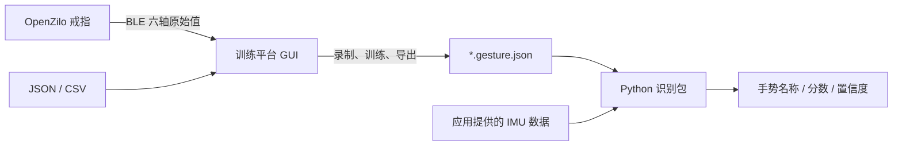

<p align="center">
  <a href="https://openzilo.com"></a>
</p>

<h1 align="center">OpenZilo 手势训练平台与 Python 识别包</h1>

<p align="center">在 GUI 中连接戒指、录制和训练手势，将模型导出给 Python 应用使用。</p>

<p align="center">
  <a href="README.md">English</a> · <a href="studio/README.md">训练平台</a> ·
  <a href="docs/architecture.md">架构与导出格式</a> · <a href="docs/sdk.md">SDK 接入</a> ·
  <a href="LICENSE">MPL-2.0</a>
</p>

这是 OpenZilo 官方的自定义戒指手势训练参考项目，使用左到右 Gaussian HMM。项目分为两个**可独立安装的发行包**：

| 部分 | 位置 / Python 导入名 | 用途与依赖 |
| --- | --- | --- |
| 训练平台 `hmm-gesture-studio` | `studio/` / `hmm_gesture_studio` | Tkinter 桌面 GUI，实时六轴曲线、手势录制/训练/导出/试识别、戒指录音接收与下载；依赖识别包和官方 OpenZilo SDK |
| 识别包 `hmm-gesture` | `src/hmm_gesture/` / `hmm_gesture` | 加载导出的模型，整段分类或流式分段识别；只依赖 NumPy、SciPy、hmmlearn，**不依赖 GUI、BLE 或训练平台** |



> 训练与识别均在电脑端运行。不刷固件，不向戒指上传模型，也不替换戒指内置的 `0x0702` 手势识别；使用的是 `0x0605` 原始 IMU 数据。

## 快速开始：训练平台

需要 [uv](https://docs.astral.sh/uv/getting-started/installation/)、Git，以及带 Tkinter 的 Python。`.python-version` 将开发环境固定在 **Python 3.12**，两个包仍支持 Python 3.10+。

```bash
git clone https://github.com/ziloai/OpenZilo-HMM.git
cd OpenZilo-HMM
uv sync --locked --all-packages
uv run --locked --all-packages hmm-gesture-studio
# 或：uv run --locked --package hmm-gesture-studio python -m hmm_gesture_studio
```

两个包由同一个 uv 工作区管理，共用 `.venv/` 和纳入版本控制的 `uv.lock`。`--all-packages` 安装两个包，无需手动创建或激活虚拟环境；`--locked` 检查依赖声明与锁文件一致。依赖统一维护在 `pyproject.toml` 中，不再单独维护 requirements 文件。

Tkinter 由 Python/操作系统提供，不是普通 Python 包依赖；Ubuntu/Debian 可安装 `python3-tk`，Homebrew Python 需匹配版本的 `python-tk`。必要时用 `uv sync --locked --all-packages --python /path/to/python3.12` 指定带 Tk 的解释器。需在有图形桌面的环境运行 GUI。

### 在 GUI 中完成训练

1. **连接戒指**：点击扫描并选择设备，或手动输入地址后连接。成功连接后保存到本机设备历史，下次直接从下拉框选择（可清空历史）。macOS 地址通常为 UUID。界面分别显示 BLE 连接与 IMU 上报状态；录音模式也能连接，切到手势模式后自动开始刷新六轴数值。
2. **录制**：输入手势名称，点击“开始一次录制”，做一次动作后停止，自动显示本次完整的滤波波形，可叠加原始数据、切换重复次数。为拒识标定每类至少录制三次，建议五到十次以上，再“保存 / 追加”。默认每次至少 12 个样本；短录制只预览、不占用次数。保存到同名、同采样率数据时会询问是否追加，不静默覆盖。
3. **管理数据**：选择工作目录（默认 `gestures/`），刷新、查看每个手势的重复数和长度，或导入 JSON / 多个 CSV。每个 CSV 是一次重复，无表头、六列原始整数值。未保存的录制可以撤销或清空；有未保存数据时锁定名称，避免误混入其他手势。
4. **训练**：响指/敲击先点“应用短促动作 / 响指预设”，关闭容易抹掉尖峰的中值滤波，训练与实时识别使用同样的冲击前后窗口；其他动作可用连续动作预设。中值点数 `1` 表示关闭，低通必须小于采样率一半。后台训练包含标准化、方差正则化及拒识标定；每类至少 3 次。至少 4 次时可点“留出评估”；单类只报告正样本通过率，不代表误触率。参数或数据改变后需重新训练，详见 [Studio 说明](studio/README.md)。
5. **导出**：将结果保存为 `*.gesture.json`，其中包含原始手势名称、HMM 参数、预处理配置和流式分段配置。使用端不需要再手动匹配这些参数。
6. **试识别**：可使用当前模型或加载已导出模型，连接相同采样率戒指，开启“实时试识别”。先静止建立基线，手势结束后恢复静止。

“实时六轴曲线”页分组显示加速度与陀螺仪；实时识别成功后，以紫色虚线框标注对应采样片段和手势名称。可冻结显示或清空曲线，不影响后台录制。录制间隙持续消费 IMU，避免积压旧数据。模式切换导致停报时保留 BLE 连接，切回手势模式后重试上报；真正掉线时自动退避重连。间断会取消未完成的手势，已完成的重复仍可保存。退出前尝试停止上报并断开设备，手动断开会终止重连。GUI 不会自动切换设备模式或配置硬件采样率。

BLE 需要蓝牙适配器和权限，Linux 需要 BlueZ；macOS 需要允许终端/IDE 使用蓝牙。手势功能无需 `ffmpeg`，戒指录音转 WAV 需要系统安装 `ffmpeg`；未安装时仍可保存原始 `.bin`。当前接入基于 SDK **0.5.0**、协议 **v4**，固件文档基线为 **`V2.000.0001.0015`**；实际兼容性需在目标戒指上确认。SDK 固定提交见 [`studio/pyproject.toml`](studio/pyproject.toml)。

## 戒指录音接收与下载

在“戒指录音”页选择保存目录，点击“开启自动接收”，将戒指切到录音模式，**长按戒指按键录音、松开后推送**。Studio 保存原始 `.bin`，安装 `ffmpeg` 后同时生成 WAV，支持打开文件播放和打开目录。漏收的文件可通过“查询戒指历史录音”按索引下载，不自动删除设备文件。

SDK **没有远程开始/停止录音命令**，GUI 按钮只控制电脑端接收/下载，不控制戒指麦克风。自动接收待机时不阻塞 IMU；实际文件传输/查询与 IMU 串行，完成后恢复手势探测，无需停止自动接收就能切回手势模式。此前开启的实时识别会在模式暂停后恢复。未传输完整的文件需重新下载，显示的传输进度不是录音计时。完整流程见 [Studio 使用说明](studio/README.md)。

## 不连接硬件先试一下

在 GUI 选择 `sample_data/` 作为数据目录并训练，或使用新的命令行：

```bash
uv run --locked --package hmm-gesture-studio hmm-gesture-train --data sample_data --output exports/demo.gesture.json
uv run --locked python examples/recognize_export.py --bundle exports/demo.gesture.json --input "sample_data/向上.json"
```

示例包含六类手势（打响指、甩手、向上、向下、向左、向右），每类五次，采样率 25 Hz。示例旧 JSON 缺失采样率时按 25 Hz 解释。训练后识别同一批数据只能验证流程，**不是独立准确率评测**。

## 在自己的 Python 程序中使用

在仓库根目录运行 `uv sync --locked`，只安装识别包及数值计算依赖（会从共用环境中移除 Studio / BLE 依赖）。如果在另一个 uv 应用中使用，请在该应用目录运行：

```bash
uv add /path/to/OpenZilo-HMM
```

也可以在本仓库构建独立 wheel，再交付给使用端：

```bash
uv build --package hmm-gesture --wheel
# 在使用端项目中：
uv add /path/to/OpenZilo-HMM/dist/hmm_gesture-0.2.0-py3-none-any.whl
```

以下代码中的 `samples` 是一整次手势的 `(N, 6)` 原始 IMU 数据：

```python
from hmm_gesture import GestureRecognizer

recognizer = GestureRecognizer.load("demo.gesture.json", min_confidence=0.0)
print(recognizer.gesture_names, recognizer.sample_rate_hz)

result = recognizer.predict(samples, sample_rate_hz=25)
if result is not None:
    print(result.name, result.confidence, result.score)
```

也可以由应用自行提供连续数据，例如 SDK、串口、网络或文件：

```python
# batch: 若干行 [ax, ay, az, gx, gy, gz]
for result in recognizer.feed(batch, sample_rate_hz=25):
    print(result.name, result.confidence)

recognizer.reset()  # 断连、重新佩戴或开始新数据流时重置分段和基线
```

`feed()` 返回通过检查的所有完整手势，一个批次可能有多个。`predict()` 在连续模式对整段分类；短促模式使用与训练/流式一致的窗口，仅接受恰好一个完整事件。过短或拒识时返回 `None`。导出文件使用带版本的 JSON 数值参数，加载不执行 pickle。详见 [API 与格式说明](docs/architecture.md)。

### 数据与识别边界

- 轴顺序固定为 **`ax, ay, az, gx, gy, gz`**，单位为原始有符号 int16 值，不是 g 或度/秒。包会检查形状、有限值和范围。
- 采样率参数用于检查，不改变设备采样率，也不自动重采样。应用需保持佩戴方向、原始单位、量程与训练时一致。
- v1/默认 API 保留基线能量分段（阈值 1500，最短 12 帧、最长 125 帧）；Studio 新训练按采样率换算时长，并可选短促冲击模式。流结束时不强行分类未完成动作。
- 置信度是最优与次优 HMM 分数差的经验指标，**不是概率**。单模型 `confidence=None`，不再伪造固定 0.8；无拒识标定的单类模型调用非空 `feed()` 会报错，请至少用 3 次录制重新训练标定。
- v2 导出包含新增滤波/分段/拒识设置；v1 仍可读取并保留原离线分数。拒识依赖正样本分数、强度和长度，不保证可靠排除所有未知动作，需补充负样本及独立会话评测。
- 一份识别器维护一条流的状态，不应在多个线程/设备间共享。用独立录制的数据评测实际效果。

## 原命令行兼容

安装两个包后，原入口仍可用：

```bash
uv run --locked --all-packages python record_gesture.py --name snap --ring --address "设备地址" --reps 5
uv run --locked --all-packages python train_hmm.py --data sample_data --output models
uv run --locked --all-packages python recognize.py --models models --input "sample_data/向左.json"
```

旧训练命令继续输出 `.pkl`，旧识别入口保留读取功能。**只加载可信 pickle**，反序列化可能执行代码。旧模型缺少预处理参数，新包/GUI 不直接导入它们；请用 `sample_data/` 或自己的 JSON 重新训练导出。旧录制 CLI 的同名保存仍为覆盖；GUI 的保存则有追加确认。

## 目录与开发

```text
pyproject.toml               识别包打包配置与 uv 工作区
uv.lock                      共享依赖锁文件，纳入版本控制
.python-version              开发 Python 版本（3.12）
src/hmm_gesture/              配置、预处理、模型格式、分段与推理 API
studio/pyproject.toml         训练平台的独立打包配置与 SDK 依赖
studio/src/hmm_gesture_studio/ GUI、数据集、训练、BLE 后台服务
examples/recognize_export.py  无 GUI/SDK 的使用示例
sample_data/                 训练示例 JSON
pretrained_models/           保留的旧版 pickle 示例
record_gesture.py 等          原命令行兼容入口
tests/                       推理、导出、GUI 控制逻辑和 SDK mock 测试
```

```bash
uv run --locked --all-packages python -m unittest discover -s tests -v
uv build --all-packages --wheel
```

添加识别包依赖使用 `uv add 包名`，仅训练平台需要的依赖使用 `uv add --package hmm-gesture-studio 包名`；提交时一并提交对应的 `pyproject.toml` 和 `uv.lock`。手动修改依赖声明后，运行 `uv lock`，再运行 `uv sync --locked --all-packages`。升级某个依赖可用 `uv lock --upgrade-package 包名`，随后同步并测试。

自动测试不访问真实 BLE；界面与设备需在目标平台上联调。升级 SDK 时需同时核对 [SDK 接入文档](docs/sdk.md) 和固定提交。问题反馈：[GitHub Issues](https://github.com/ziloai/OpenZilo-HMM/issues)。

## 许可证

软件、文档、示例数据、预训练模型及随附素材采用 [MPL-2.0](LICENSE)，与 OpenZilo 软件许可一致；示例数据、模型和图片已获授权再分发。第三方依赖保留各自许可证，品牌与商标属于其权利人。详见 [NOTICE.md](NOTICE.md)。
